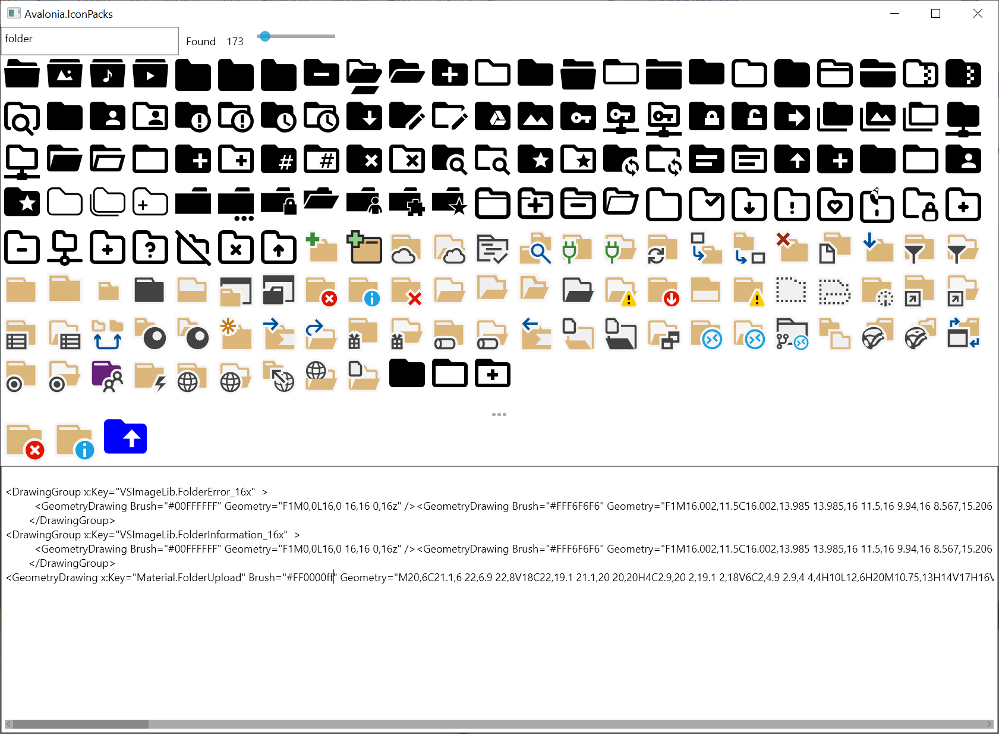

# Avalonia.IconPacks

[](https://github.com/ahopper/Avalonia.IconPacks/actions)

Import of more than 21,000 vector icons from the Visual Studio image library, [VSCode Icons](https://github.com/microsoft/vscode-icons) and [MahApps.Metro.IconPacks](https://github.com/MahApps/MahApps.Metro.IconPacks) for use in [Avalonia](https://github.com/AvaloniaUI/Avalonia)

To use the icons either copy the files from the Icons directory to your project or run Avalonia.IconPacks to browse and generate a file of just the icons you want.

Pre built binaries for windows,linux and osx can be downloaded from the [Actions page](https://github.com/ahopper/Avalonia.IconPacks/actions)

You can use the icon code directly in xaml
```
<Button>
	<DrawingPresenter Width="16" Height="16">
	    <DrawingPresenter.Drawing>
		     <GeometryDrawing Brush="#FF000000" Geometry="M 22,12 H 18 L 15,21 9,3 6,12 H 2"/>
 	    </DrawingPresenter.Drawing>
	</DrawingPresenter>		  
</Button>

```
or reference the icon included in a style
```
<Button>
	 <DrawingPresenter Width="16" Height="16" Drawing="{DynamicResource VSImageLib.Settings}" />
</Button>

```
To do this you typically include the icon file in App.xaml
```
 <Application.Styles>
      <StyleInclude Source="avares://Avalonia.Themes.Default/DefaultTheme.xaml"/>
      <StyleInclude Source="avares://Avalonia.Themes.Default/Accents/BaseLight.xaml"/>
      <StyleInclude Source="avares://MyProject/Icons/Icons.xaml"/>
</Application.Styles>
```
Icons can be saved as .ico or .icns by right clicking in the preview pane.

There is a useful tool [here](https://gist.github.com/dfkeenan/d5ce7ba64f796e41cd9202b416c994bd) to transform the colors of the vs studio icons to match different themes. 
The Iconpacks program loads icons at startup from the icons directory so external icons can be added just by copying xaml files to that directory. 



If you find this project useful please go and star the [MahApps.Metro.IconPacks](https://github.com/MahApps/MahApps.Metro.IconPacks) project as that is where all the hard work has been done.

